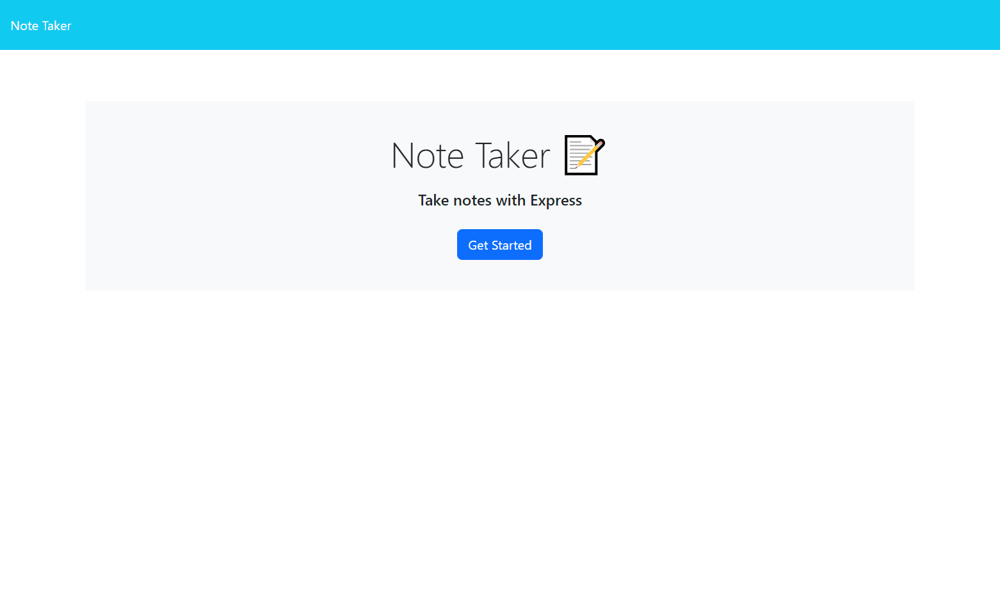
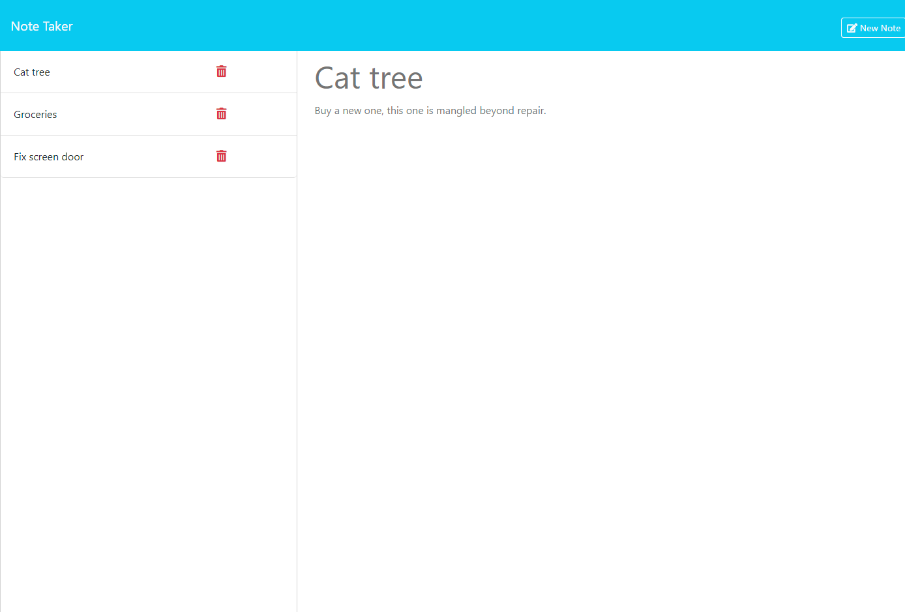

# Note-Taker

## Table of Contents

- [Description](#description)
- [Installation](#installation)
- [Usage](#usage)
- [Credits](#credits)
- [Application Link](#deployed-application-link)
- [Screenshots](#screenshots)
- [Contribute](#contribute)
- [License](#license)
- [Questions](#questions)

## Description

This application is a basic and nifty note taking application to use anytime to save a quick note. The application uses an Express.js back end and will save and retrieve note data from a JSON file. It is deployed on Heroku.  The front end was already created by edX OSU Bootcamp.

## Installation
 - [Visual Studio Code](https://code.visualstudio.com/)
 - [node.js](https://nodejs.org/en)
 - [express](https://www.npmjs.com/package/express)
 - [path](https://www.npmjs.com/package/path)
 - [uuid](https://www.npmjs.com/package/uuid)

    - Information on fs, or filesystem, included with node.js can be found [here](https://nodejs.org/api/fs.html)
    - You can sign up for a Heroku account [here](https://id.heroku.com/login)

## Usage

1. Head to the application [link](https://note-taker-osubootcampapp-902389d6790b.herokuapp.com/).
2. Click on the Get Started button.
3. Type in a Note title and text, then click Save Note in top right corner.
4. Saved notes will appear on the left side in a list.
5. You have the option to delete a Note by clicking the 🗑️ icon.
6. If you have multple notes listed, you can select one to read in the main area of page.
7. While making a new note you have the option to Clear Form in the top right corner.

## Deployed Application link

[Application link](https://note-taker-osubootcampapp-902389d6790b.herokuapp.com/)

## Screenshots

## Credits

 1. This application is an assignment from module 11 from [The Ohio State University Coding Boot Camp](https://eng-bootcamps.osu.edu/)
 2. The front end was provided by edX OSU Bootcamp materials along with the 'helpers' folder file 'fsUtils.js'.  Functions where used from this file to assist in connecting the front end with the back end.

## Contribute 

If you would like to contribute please use the [Contributor Covenant](https://www.contributor-covenant.org/).

## License

   

***MIT License***

## Questions

 - Github Profile for [rickibobbii](https://github.com/rickibobbii)
